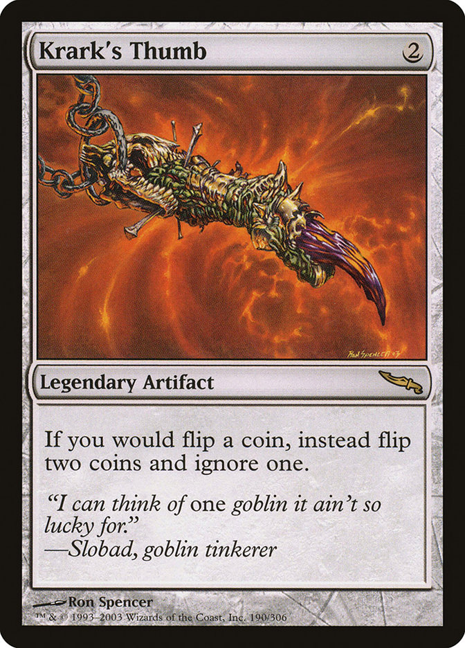

# 🪙 MTG Coin Flip Simulator

A simple coin flip simulator inspired by Magic: The Gathering mechanics.

Includes a rule-based modifier (**Krark’s Thumb**) and tracks basic flip statistics over time.

---

## 📸 Screenshot

---

## 🧠 Krark’s Thumb

When enabled, each coin flip is simulated twice and the better result is chosen.

---

## 🎮 Features

- Flip a coin
- Flip X coins
- Flip until success or failure
- Krark’s Thumb mode
- Tracks:
  - Heads / Tails
  - Win rate
- Flip history
- Light / Dark mode

---

## 🛠 Tech

- SvelteKit
- TypeScript
- HTML / CSS
- JavaScript
